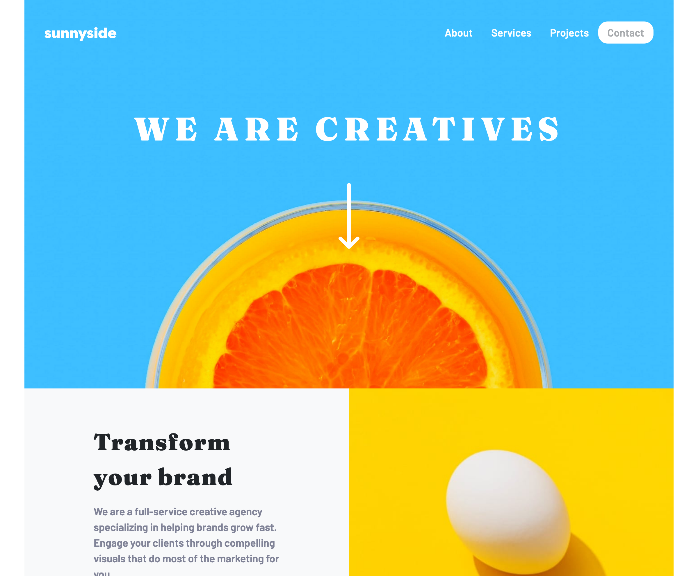

# Frontend Mentor - Product preview card component solution

This is a solution to the [Sunnyside Agency challenge on Frontend Mentor](https://www.frontendmentor.io/challenges/sunnyside-agency-landing-page-7yVs3B6ef). Frontend Mentor challenges help you improve your coding skills by building realistic projects. 

## Table of contents

- [Overview](#overview)
  - [The challenge](#the-challenge)
  - [Screenshot](#screenshot)
  - [Links](#links)
- [My process](#my-process)
  - [Built with](#built-with)
- [Author](#author)

## Overview

### The challenge

Users should be able to:

- View the optimal layout depending on their device's screen size
- See hover and focus states for interactive elements

### Screenshot

### Links

- Solution URL: [https://github.com/warehouse827/sunnyside-agency-landing-page.git]
- Live Site URL: [https://warehouse827.github.io/sunnyside-agency-landing-page/]

## My process

### Continued development

- Bootstrap
- Flex and Grid
- Adobe XD

### Built with

- Bootstrap 5.2
- Mobile-first workflow

## Author

- Website - [https://warehouse827.com]
- Frontend Mentor - [https://www.frontendmentor.io/profile/warehouse827]
